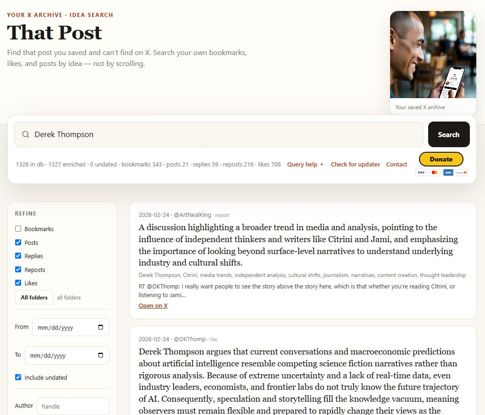

# That Post

Idea search over what you bookmarked, liked, or posted.

Private, local index of your X (Twitter) bookmarks, likes, and posts. Search by idea or keyword. Optional summaries. Optional phone copy on Netlify (keep that site private).

**Download:** [https://audiobalance.com/thatpost](https://audiobalance.com/thatpost)  
**Releases:** [github.com/artnking/that-post/releases](https://github.com/artnking/that-post/releases)  
**License:** MIT. Free.

X’s free app login is not enough for bookmarks and likes. You need an [X Developer](https://console.x.com/) app and **$5** of pay-per-use API credits (this project’s first sync is usually **under $1**). SuperGrok / X Premium does not pay for those credits.

## Install

1. Get the zip from the [download page](https://audiobalance.com/thatpost) or [Releases](https://github.com/artnking/that-post/releases).
2. Unzip it.
3. Hand **Install_Instructions.md** to ChatGPT, Claude, Grok, DeepSeek, or any competent assistant and say:

   > Walk me through installing That Post on this computer. Follow Install_Instructions.md.

Windows, Linux, and Mac. Python 3.11+.

After it works, **User_Guide.md** is how you keep the index up to date (`sync.bat` / `python3 scripts/sync_x.py`).

## Contact

- **Bugs and ideas:** [GitHub Issues](https://github.com/artnking/that-post/issues)
- **Email:** [ThatPost@audiobalance.com](mailto:ThatPost@audiobalance.com)

See [CONTRIBUTING.md](CONTRIBUTING.md) if you want to send a pull request.
